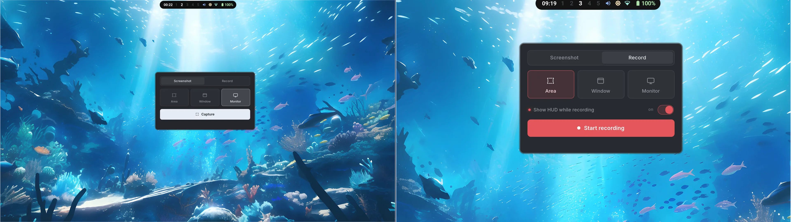
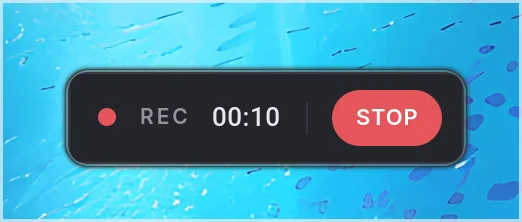

# Hyprscreen

**A first-class screenshot and screen-recording app built for Hyprland.**

Fast. Native. One window. No compromises.

<p align="center">
  
</p>
<p align="center">
  
</p>

## Features

- Screenshots and recordings — area, window, or full monitor
- One-window flow with built-in preview: save, copy, open, reveal, repeat
- Live dimensions while selecting an area
- Monitor identifier overlays — pick the right screen, every time
- Optional recording HUD with a global `hyprscreen stop` CLI

## Install

```bash
git clone https://github.com/franlol/hyprscreen
cd hyprscreen
cargo build --release
sudo install -Dm755 target/release/hyprscreen /usr/local/bin/hyprscreen
```

Requires: `slurp`, `grim`, `wf-recorder`, `wl-clipboard`, `hyprctl`, `ffmpeg`.

AUR package coming soon.

## Usage

```bash
hyprscreen                                   # open the GUI
hyprscreen screenshot {area|window|monitor}  # capture, no clicks
hyprscreen record {area|window|monitor}      # start a recording
hyprscreen stop                              # stop the active recording
hyprscreen --version                         # print version
hyprscreen --help                            # print usage
```

Suggested Hyprland binds:

```conf
bind = SUPER, PRINT,       exec, hyprscreen screenshot area
bind = SUPER CTRL, PRINT,  exec, hyprscreen record area
bind = SUPER SHIFT, PRINT, exec, hyprscreen stop
```

## Configuration

Optional config at `~/.config/hyprscreen.conf`. All keys are optional — missing values fall back to sensible defaults.

```ini
# General
default_mode=screenshot         # screenshot | record
default_target=area             # area | window | monitor

# Recording
show_recording_hud=true
recording_indicator_enabled=true
recording_indicator_interval_seconds=5
recording_indicator_duration_ms=300

# Storage
save_dir_screenshots=~/Pictures/Screenshots
save_dir_recordings=~/Videos/Recordings

# Integration
open_video_command=mpv
reveal_folder_command=thunar

# Naming
filename_prefix=hyprscreen
timestamp_format=%H%M%S%d%m%Y
```

| Key | Purpose |
| --- | --- |
| `default_mode` | UI selection on launch — `screenshot` or `record`. |
| `default_target` | Target selection on launch — `area`, `window`, or `monitor`. |
| `show_recording_hud` | Show the floating recording HUD with timer and Stop button. |
| `recording_indicator_enabled` | When the HUD is hidden, flash a small red indicator on the target screen. |
| `recording_indicator_interval_seconds` | Seconds between indicator flashes. |
| `recording_indicator_duration_ms` | Length of each indicator flash in milliseconds. |
| `save_dir_screenshots` | Where `Save` writes screenshots. |
| `save_dir_recordings` | Where `Save` writes recordings. |
| `open_video_command` | Player invoked by `Open` for recordings. Falls back to common players if unset. |
| `reveal_folder_command` | File manager invoked by `Reveal`. Falls back to common file managers if unset. |
| `filename_prefix` | Prefix used when generating output file names. |
| `timestamp_format` | strftime-style timestamp suffix (`%Y %m %d %H %M %S`). |

## License

[MIT](LICENSE)
