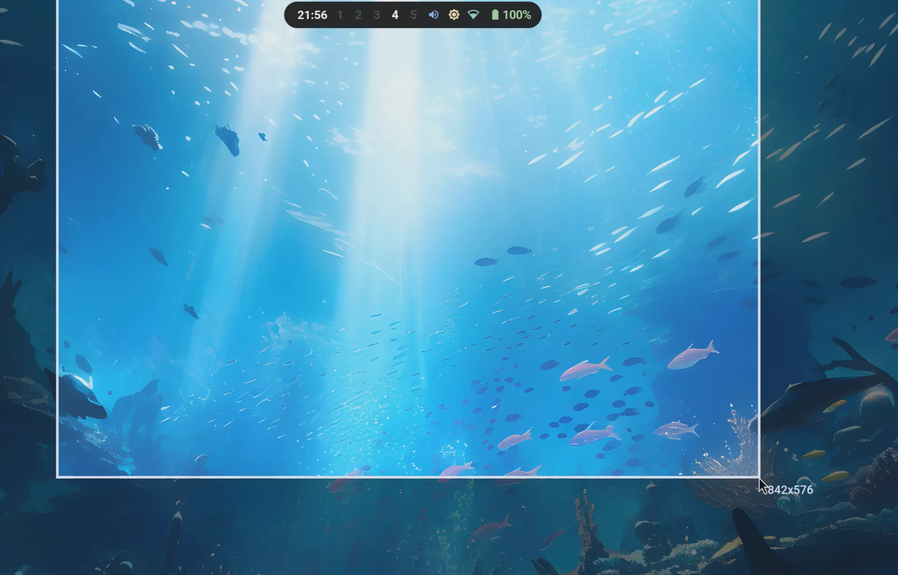

# Hyprscreen

**A first-class screenshot and screen-recording app built for Hyprland.**

Fast. Native. One dock. No compromises.

<p align="center">
  
</p>
<p align="center">
  
</p>
<p align="center">
  
</p>

## Features

- **Capture Dock** — a compact glass command bar: mode, target, delay, pointer, fire
- Screenshots and recordings — area, window, or full monitor, teal/coral accents by mode
- **Corner thumbnail** after every capture: annotate, copy, save, share, GIF, discard — auto-saved by default
- **Annotation editor** — arrow, box, text, step counter, highlight, pixelate blur, five inks, undo
- **Recording HUD** with pause/resume (lossless segments), restart, mic, timer, stop
- MP4 or WEBM recording, optional microphone audio, GIF export post-capture
- Delay countdown overlay (3/5/10s) with Esc cancel
- Monitor identifier overlays — pick the right screen, every time
- Toast feedback with Reveal/Retry actions; `?` opens a shortcuts cheatsheet
- Global `hyprscreen stop` CLI — works even while paused

## Install

```bash
git clone https://github.com/franlol/hyprscreen
cd hyprscreen
cargo build --release
sudo install -Dm755 target/release/hyprscreen /usr/local/bin/hyprscreen
```

Requires: `slurp`, `grim`, `wf-recorder`, `wl-clipboard`, `hyprctl`, `ffmpeg`.

### AUR

```bash
paru -S hyprscreen
```

## Usage

```bash
hyprscreen                                   # open the dock
hyprscreen screenshot {area|window|monitor}  # capture, no clicks
hyprscreen record {area|window|monitor}      # start a recording
hyprscreen stop                              # stop the active recording
hyprscreen --version                         # print version
hyprscreen --help                            # print usage
```

Dock keys: `Enter` fire · `1/2/3` target · `S/R` mode · `D` delay · `P` pointer · `?` shortcuts · `Esc` quit.

Suggested Hyprland binds:

```conf
bind = SUPER SHIFT, 4, exec, hyprscreen screenshot area
bind = SUPER SHIFT, 5, exec, hyprscreen screenshot window
bind = SUPER SHIFT, 3, exec, hyprscreen screenshot monitor
bind = SUPER SHIFT, R, exec, hyprscreen record area
bind = SUPER SHIFT, X, exec, hyprscreen stop
```

## Configuration

Optional config at `~/.config/hyprscreen/hyprscreen.conf`. All keys are optional — missing values fall back to sensible defaults.

```ini
# General
dock_style=glass                # glass | solid
autosave=true                   # save captures immediately
thumbnail_timeout_seconds=8     # auto-dismiss the thumbnail card (0 = never)
capture_delay_seconds=0         # initial delay chip value
show_pointer=true               # include the cursor (screenshots)
default_mode=screenshot         # screenshot | record
default_target=area             # area | window | monitor

# Recording
recording_format=mp4            # mp4 | webm
record_audio=false              # microphone via wf-recorder
audio_device=                   # optional wf-recorder audio device
hud_style=full                  # full | compact
show_recording_hud=true
recording_indicator_enabled=true
recording_indicator_interval_seconds=5
recording_indicator_duration_ms=300
gif_fps=15                      # frame rate of GIFs exported from a recording
gif_max_width=800               # max GIF width in px (never upscales)

# Annotation
annotate_default_color=#5EE6D0

# Storage
save_dir_screenshots=~/Pictures/Screenshots
save_dir_recordings=~/Videos/Recordings

# Integration
open_video_command=mpv
reveal_folder_command=thunar

# Naming
filename_prefix=hyprscreen
timestamp_format=%H%M%S%d%m%Y
```

| Key | Purpose |
| --- | --- |
| `dock_style` | `glass` (translucent + Hyprland blur) or `solid` surfaces. |
| `autosave` | Save captures immediately; `false` pins them to the thumbnail card until Save. |
| `thumbnail_timeout_seconds` | Auto-dismiss delay for the auto-saved thumbnail card (`0` = never). |
| `capture_delay_seconds` | Initial value of the dock's delay chip. |
| `show_pointer` | Include the cursor in screenshots (`grim -c`). |
| `default_mode` | UI selection on launch — `screenshot` or `record`. |
| `default_target` | Target selection on launch — `area`, `window`, or `monitor`. |
| `recording_format` | `mp4` (libx264) or `webm` (VP9 + Opus). |
| `record_audio` | Record microphone audio via wf-recorder. |
| `audio_device` | Specific wf-recorder audio device (optional). |
| `hud_style` | `full` (pause/restart/mic/stop) or `compact` (timer + stop pill). |
| `show_recording_hud` | Show the floating recording HUD. |
| `recording_indicator_enabled` | When the HUD is hidden, flash a small red indicator on the target screen. |
| `recording_indicator_interval_seconds` | Seconds between indicator flashes. |
| `recording_indicator_duration_ms` | Length of each indicator flash in milliseconds. |
| `gif_fps` | Frame rate of GIFs exported from a recording (default `15`). |
| `gif_max_width` | Maximum width in px for exported GIFs; never upscales (default `800`). |
| `annotate_default_color` | Initial ink color in the annotation editor. |
| `save_dir_screenshots` | Where screenshots are saved. |
| `save_dir_recordings` | Where recordings are saved. |
| `open_video_command` | Player invoked for recordings. Falls back to common players if unset. |
| `reveal_folder_command` | File manager invoked by Reveal. Falls back to common file managers if unset. |
| `filename_prefix` | Prefix used when generating output file names. |
| `timestamp_format` | strftime-style timestamp suffix (`%Y %m %d %H %M %S`). |

## License

[MIT](LICENSE)
